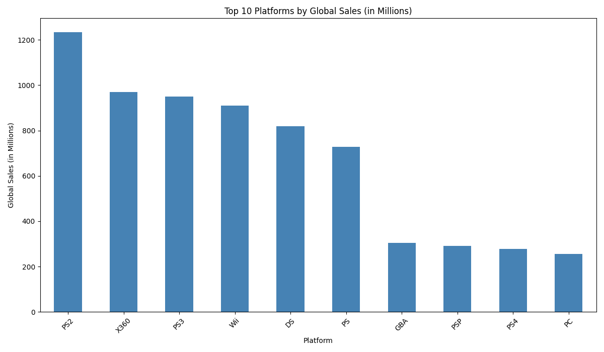
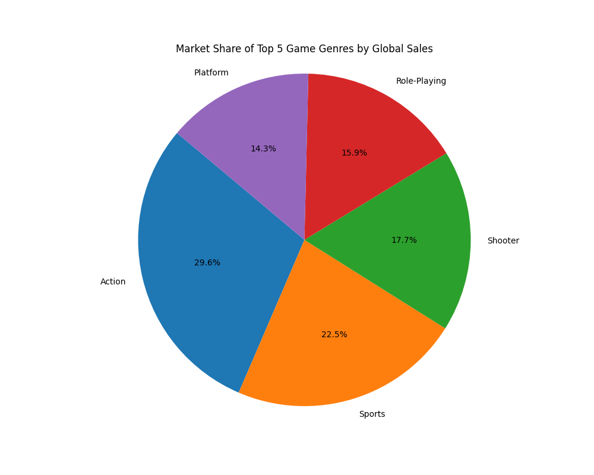
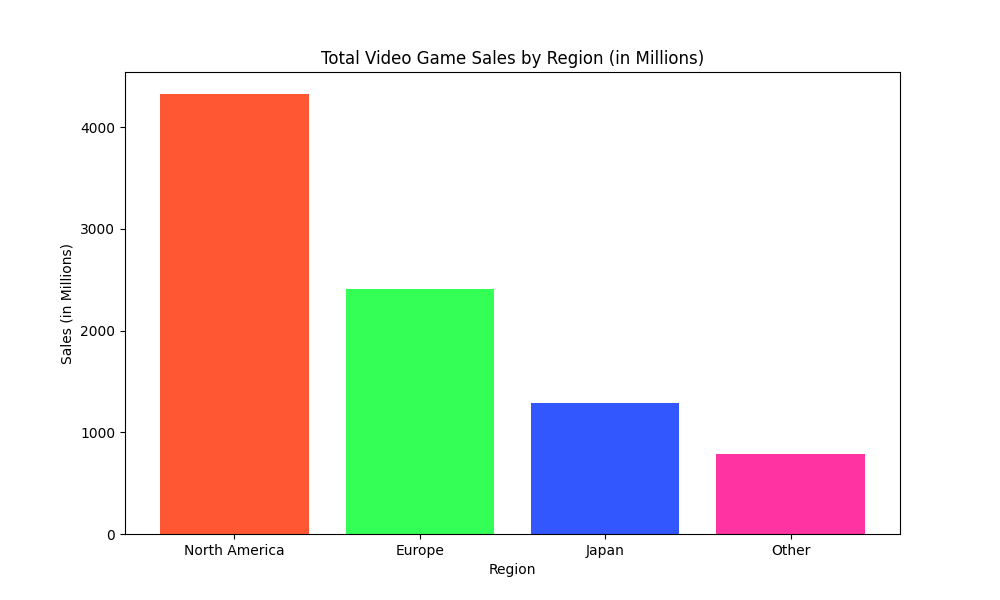
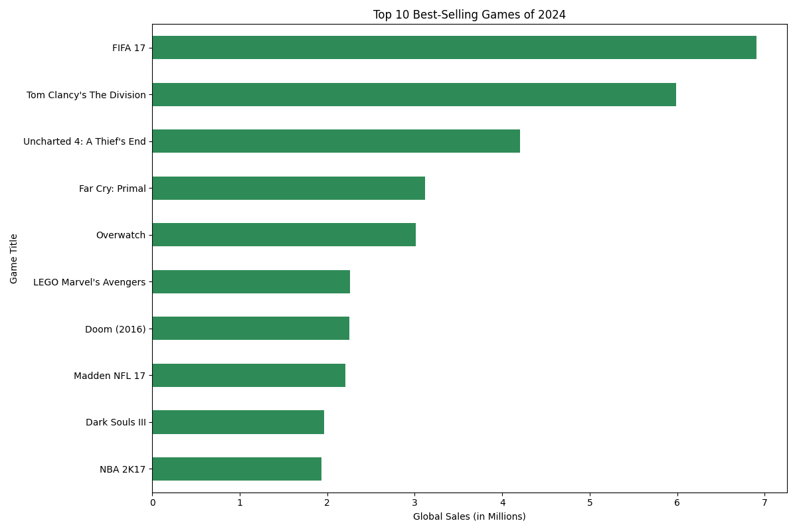

# 🎮 Video Game Sales Analysis Project

This is a data analysis project that analyzes the 'vgsales.csv' dataset to uncover trends in video game sales. The goal was to answer strategic questions a game developer or publisher might ask.

**Skills Demonstrated:** Python, pandas (for data manipulation), matplotlib (for data visualization).

---

## 🚀 Analysis Questions & Key Findings

I focused on answering four main questions:

### 1. Which platform has the most sales of all time?
* **Finding:** The PlayStation 2 (PS2) is the highest-selling platform of all time, followed by the Xbox 360 and PS3.
* 

### 2. What are the top 5 most popular genres?
* **Finding:** 'Action' games are the clear market leader, followed by 'Sports' and 'Shooter' games.
* 

### 3. How do sales compare across regions?
* **Finding:** North America is the largest market for video games, followed by Europe, making it a key region for sales.
* 

### 4. What were the best-selling games in a recent, data-rich year?
* **Finding:** To find a "trending" list, I analyzed the top sellers from 2016 (a recent year with complete data). 'FIFA 17', 'Pokémon Go', and 'Uncharted 4' led the pack, showing the power of established franchises.
* 

---

## 🔧 How to Run This Project

1.  Clone this repository (or download the files).
2.  Ensure you have Python, pandas, and matplotlib installed:
    ```bash
    pip install pandas matplotlib
    ```
3.  Run the main analysis script from your terminal:
    ```bash
    python analysis.py
    ```
4.  The script will print the analysis results to the console and save all four charts as `.png` files in the directory.
